# 造梦师

## AI时代电影视觉指南 · v1.1

**DREAM DIRECTOR v1.1 — Director Lens Library**

> 先让画面成为故事中的一个真实瞬间，再考虑它使用什么镜头和胶片。

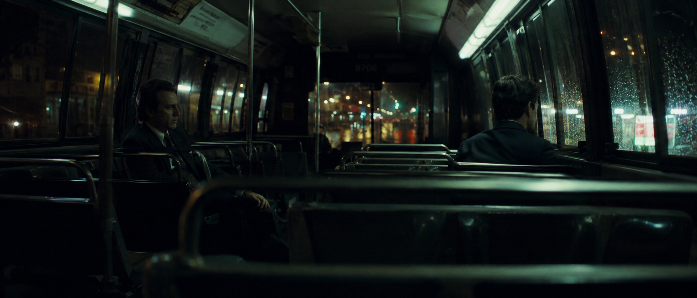

<p align="center">
  <strong>一个用于生成真实电影单帧 Prompt 的 ChatGPT / Codex Skill</strong>
</p>

<p align="center">
  不是一包“万能电影词”，而是一套从故事、人物、空间、摄影机、光线到胶片质感的完整视觉工作流。
</p>

## 下载公开版

### 造梦师：AI时代电影视觉指南 v1.1

**[前往 Releases 下载最新安装包](https://github.com/popopo-99/zy-cinematic-realism/releases/latest)**

下载 `zy-cinematic-realism-v1.1.0.zip`。压缩包顶层直接包含完整的 `zy-cinematic-realism/` 文件夹，可以安装到支持 Agent Skills 的环境中。

> v1.1 加入导演镜头库。指定导演后默认使用“强烈”模式，通过导演姓名、代表作品和场景专属影像语法，让不同导演真正重新决定这一镜在看什么。

不熟悉 GitHub 的用户，也可以点击仓库右上角的 **Code → Download ZIP**。请注意：仓库根目录是教程和展示页；仓库内部的 `zy-cinematic-realism/` 才是 Skill 本体。

## 它到底是什么？

Skill 不是一个新的 AI 模型，也不是需要重新训练的插件。

它是一套可以反复交给 AI 使用的工作流程。安装以后，当你要求 AI 生成电影感画面、降低 AI 感、设计摄影机位置或建立真实光线时，AI 会按照这套固定方法完成任务。

你可以把它理解为：

- AI 模型是摄影团队
- 你的想法是故事梗概
- 这套 Skill 是导演与摄影指导的工作手册
- 最终输出是可以交给生图或生视频模型的完整 Prompt

它会按照以下顺序工作：

`故事瞬间 → 人物行为 → 真实空间 → 摄影机位置 → 光线来源 → 胶片质感 → 场景专属 Avoid`

对外品牌是 **造梦师 / DREAM DIRECTOR**；为保持现有安装路径、自动触发和显式调用兼容，技术名称始终是 `zy-cinematic-realism`。

## 这不是一包“万能电影词”

很多所谓电影感 Prompt，删掉 `35mm / Kodak / anamorphic / film grain` 后，就只剩下“一个人站在一个很有氛围的地方”。

这套 Skill 会先替你解决更重要的问题：

- **故事**：这一刻之前发生了什么？之后还会发生什么？
- **人物**：角色在做什么小动作，而不是摆什么姿势？
- **空间**：雨水、磨损、杂物和旧物怎样参与叙事？
- **摄影机**：观众到底站在哪里看？隔着门、玻璃、座椅还是人群？
- **光线**：光来自窗户、路灯、荧光灯，还是场景里真的存在的灯？

摄影参数最后才加入。它们负责强化画面，不负责替代故事。

## 60 秒上手

### 1. 完全不懂摄影，也能这样输入

```text
请使用 $zy-cinematic-realism，把下面的想法转换成像真实电影中途被截取的一帧：

[输入一句画面想法]

请降低 AI 感，不要人物海报、概念图、游戏渲染和没有来源的电影灯光。
```

你不需要先学会专业摄影参数。最少告诉它这 5 件事：

```text
谁 + 在哪里 + 刚刚发生了什么 + 此刻的小动作 + 最不想要什么
```

### 2. 试试这个完整例子

```text
请使用 $zy-cinematic-realism：

1980 年代纽约，一次重要审讯失败后的深夜。
两个性格完全不同的侦探坐夜班公交车回警局，隔着几排座位，没有交谈。
一个看着窗外的雨，另一个盯着空座位。
不要人物海报感，不要英雄姿势，要像真实犯罪电影中段被偶然截取的一帧。
```

如果你只写了一句话也没关系，Skill 会补全缺失的故事、场景、摄影机和光线逻辑；只有会明显改变创作方向的信息，它才会向你确认。

### 3. 看懂 Skill 的输出

它默认给你三部分：

1. **画面理解**：用几句话确认它选中了哪个故事瞬间。
2. **Final Prompt**：可直接交给生图或生视频模型的完整英文提示词。
3. **Avoid**：针对当前场景的负面约束，不是机械复制的一长串词。

<details>
<summary><strong>展开看一个缩短版输出</strong></summary>

```text
A restrained frame from a 1980s New York crime drama.

Late at night, inside a nearly empty city bus moving through a rain-soaked neighborhood.
Two detectives sit several rows apart after an important interrogation has failed. Neither
speaks. One watches the city dissolve through rain and window reflections; the other stares
past an empty seat, his wet coat still buttoned.

The camera observes from the last row at seated eye level, partially blocked by worn seat
backs and metal handrails. Both characters remain small and off-center inside the bus.

Available practical light only: aged green fluorescent tubes overhead and intermittent warm
streetlights passing through wet windows. Natural exposure, muted color response, visible
35mm grain, subtle halation and slight vibration from the moving vehicle.

Avoid: promotional poster composition, hero pose, characters looking at camera, perfect
symmetry, clean modern bus, artificial rim light, excessive lens flare, HDR, CGI appearance.
```

</details>

### 4. 把结果交给生图模型

- 复制 `Final Prompt` 到你常用的生图或生视频模型。
- 模型有单独的 Negative Prompt 输入框，就把 `Avoid` 放进去。
- 没有负面词输入框，就把 `Avoid` 保留在 Final Prompt 结尾。
- 第一张图不是终点。先看故事、机位和光线是否正确，再决定要不要改焦段或胶片。

### 5. 不满意时，用一句话纠偏

不要每次推倒重写。直接告诉 Skill 哪里仍然“像 AI”：

```text
人物太像海报：让摄影机退到公交车后排，用座椅遮挡，人物缩小并偏离中心。

灯光太假：删除轮廓光，只保留车内旧荧光灯和窗外经过的橙色路灯。

环境太干净：加入磨损座椅、旧广告、地面雨水和被遗忘的报纸，但不要堆无关物品。

画面没有故事：改成冲突结束后的沉默，不要选择角色正面对峙的高潮时刻。
```

这一步通常比继续添加 `masterpiece / epic / 8K` 更有效。

## 从一条故事里，选择不同的“那一刻”

Skill 不只是在同一个构图上换滤镜。它会帮你判断，故事里哪个瞬间最值得被看见。

### 审讯正在失控

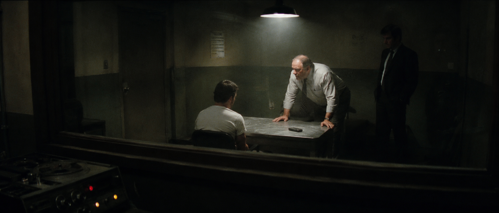

摄影机没有坐在谈判桌旁，而是在单向玻璃外。玻璃反射、监听设备和大块暗部让观众更像一个不该在场的观察者。

### 回家以后，案件还没有结束

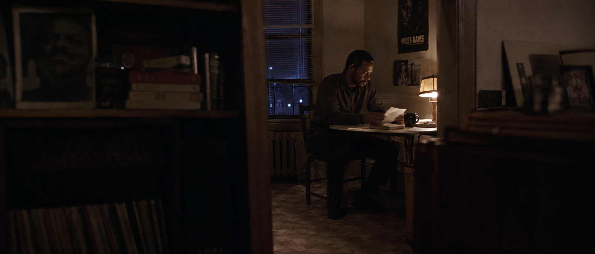

人物不需要哭喊。桌上的信、没喝完的咖啡、门框遮挡和一盏台灯，就能说明“他仍然放不下”。

### 真相揭开后的沉默

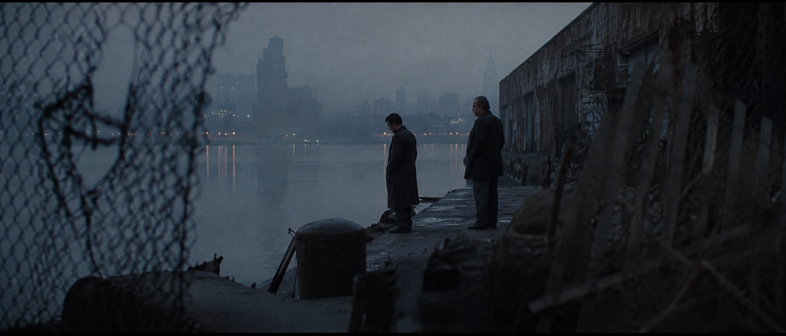

人物缩小、远离中心，城市与河面占据大部分画面。环境不再只是背景，而是在替角色说话。

### 主角离开，城市继续

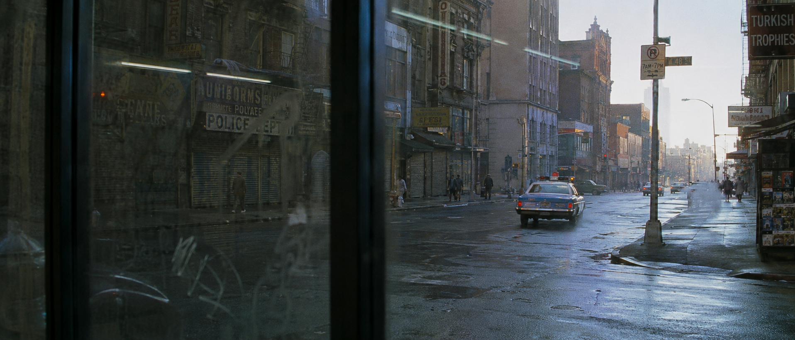

结尾不一定需要主角特写。隔着有划痕的玻璃看警车驶远，普通人开始新的一天，故事已经结束，但城市没有停下。

## 换个题材，方法仍然成立

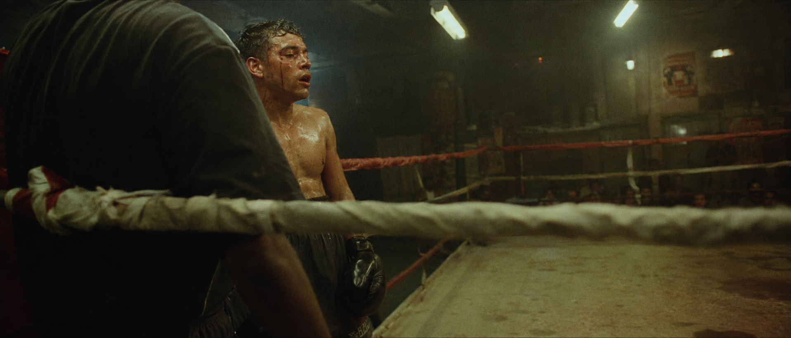

动作场面也不需要干净、完整的英雄构图。前景拳绳与对手身体遮挡视线，轻微运动模糊保留击打速度，人物甚至没有处在完美对焦中——它更像摄影机在搏斗中抢到的一帧，而不是体育广告。

犯罪片可以用，拳击片、家庭剧情、科幻、古装或城市短片也可以用。核心始终是：

> **不要只说“两名拳手激烈搏斗”。要说清楚这是第几回合、重拳命中的前后哪一秒、摄影机隔着什么看见他们，以及动作模糊应该保留多少。**

## 用导演的方法重新观察同一个故事

### 导演镜头库 Beta

导演库不是把一个导演的名字追加到 Prompt 末尾。它会把导演通常如何选择故事瞬间、安排人物与空间、放置摄影机、使用真实光源和控制时间感，改写成当前场景里看得见的决定。代表作品会帮助生图模型识别导演方向，但具体画面仍由当前场景里的决定构成。

在明确或强烈模式下，Skill 会保留导演姓名；强烈模式还会加入少量代表作品作为模型风格锚点。导演姓名负责让模型识别方向，具体的机位、调度、光线、景深和质感规则负责让结果不止停留在表面模仿。

风格强度只需记住：**轻微、明确、强烈**。轻微只借用少量方法；明确让导演风格明显影响画面；强烈让导演姓名、代表作品和标志性影像语法共同主导结果。默认强度为“强烈”：只要你指定导演，Skill 就会优先让生图模型明确识别这位导演，而不是把风格稀释成通用电影感。强烈模式会在 Final Prompt 中保留导演姓名和少量代表作品，并结合场景专属的机位、调度、调色、景深、光线和质感描述。

| 导演 | 你可能看过的作品 | 更适合的方向 |
| -- | -- | -- |
| 岩井俊二 | 《情书》、《花与爱丽丝》 | 青春记忆、季节感、私人关系、自然光 |
| 黑泽明 | 《七武士》、《罗生门》 | 天气压力、群体调度、行动方向 |
| 小津安二郎 | 《东京物语》、《晚春》 | 家庭日常、低机位静观、生活空间 |
| 王家卫 | 《花样年华》、《重庆森林》 | 城市孤独、未完成关系、反射与遮挡 |
| 侯孝贤 | 《悲情城市》、《千禧曼波》 | 远距离观察、层叠空间、日常中的时间 |
| 杨德昌 | 《一一》、《牯岭街少年杀人事件》 | 现代城市、人际关系、用建筑空间分隔人物 |
| 安德烈·塔可夫斯基 | 《潜行者》、《镜子》 | 记忆空间、缓慢时间、自然元素 |
| 斯坦利·库布里克 | 《2001太空漫游》、《闪灵》 | 几何秩序、制度压力、冷静距离 |
| 克里斯托弗·诺兰 | 《盗梦空间》、《星际穿越》 | 时间压力、清楚的空间关系、真实物理后果 |
| 丹尼斯·维伦纽瓦 | 《降临》、《银翼杀手2049》 | 巨大环境、空间压迫、环境中的渺小人物 |
| 大卫·芬奇 | 《七宗罪》、《社交网络》 | 调查过程、精确机位、受控空间 |
| 泰伦斯·马力克 | 《细细的红线》、《生命之树》 | 自然光、漂移观察、触觉细节 |

```text
请使用 $zy-cinematic-realism：

高中毕业后的最后一天，一个女孩独自在空教室里收拾书本。
导演参考：岩井俊二
风格强度：明确

不要复制任何具体电影场景。请把导演方法转换成故事瞬间、人物动作、摄影机位置和自然光。
```

> 指定导演时，默认按“强烈”执行：导演姓名和少量代表作品会作为模型锚点保留，但真正决定画面的仍然是当前故事、人物、空间、摄影机和光线。

```text
请使用 $zy-cinematic-realism：

[你的场景]

导演参考：黑泽明
风格强度：强烈

请不要复制任何具体电影场景。
请让导演的影像语法明显主导故事瞬间、人物调度、机位、光线和质感。
```

## 同一个故事，不同导演会看见什么？

这组测试固定了同一个故事、人物、年代、地点和证据线索，只改变导演参考。无导演版本保持基础电影现实主义；指定导演后，Skill 默认使用“强烈”模式，在 Final Prompt 中保留导演姓名和代表作品，并重新组织故事瞬间、视觉中心、摄影机、人物与空间、光线、调色、景深和捕捉质感。

这里的差异不是给同一张图更换滤镜，而是让不同导演重新决定“这一镜到底在看什么”。

固定场景：1980 年代中期，纽约曼哈顿，深夜警局证据室；一名疲惫侦探用城市车库员工卡比对墙上的黑白监控投影。

<table>
  <tr>
    <td width="50%" align="center">
      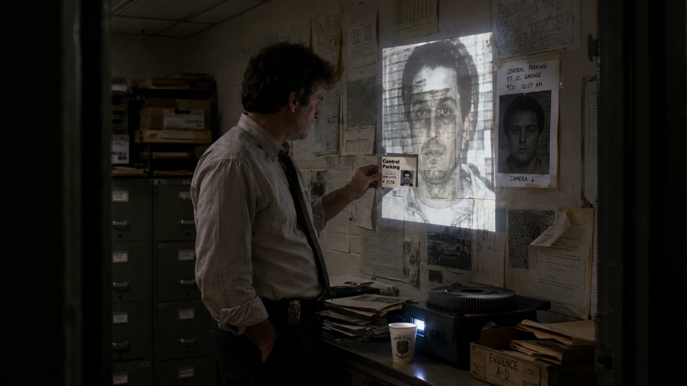
      <br>
      <strong>无导演基准</strong>
      <br>
      <sub>真实调查动作、合理机位与实用光源</sub>
    </td>
    <td width="50%" align="center">
      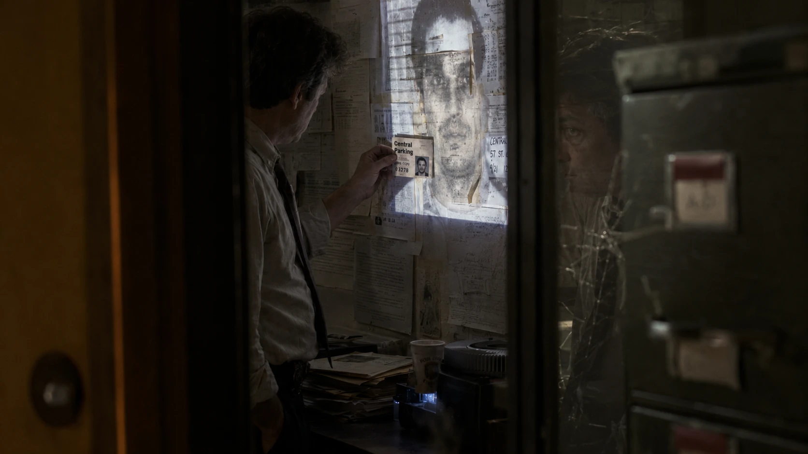
      <br>
      <strong>王家卫</strong>
      <br>
      <sub>主观时间、遮挡反射与未完成的深夜关系</sub>
    </td>
  </tr>
  <tr>
    <td width="50%" align="center">
      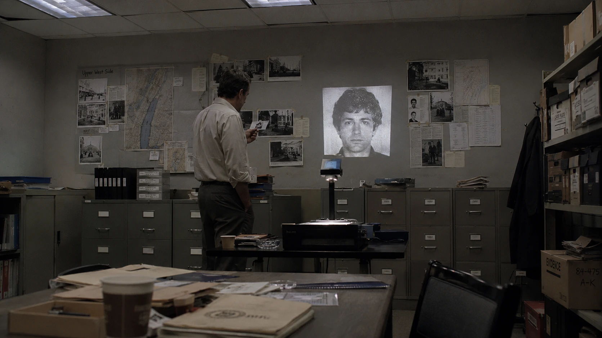
      <br>
      <strong>斯坦利·库布里克</strong>
      <br>
      <sub>制度几何、冷静距离与秩序中的不安</sub>
    </td>
    <td width="50%" align="center">
      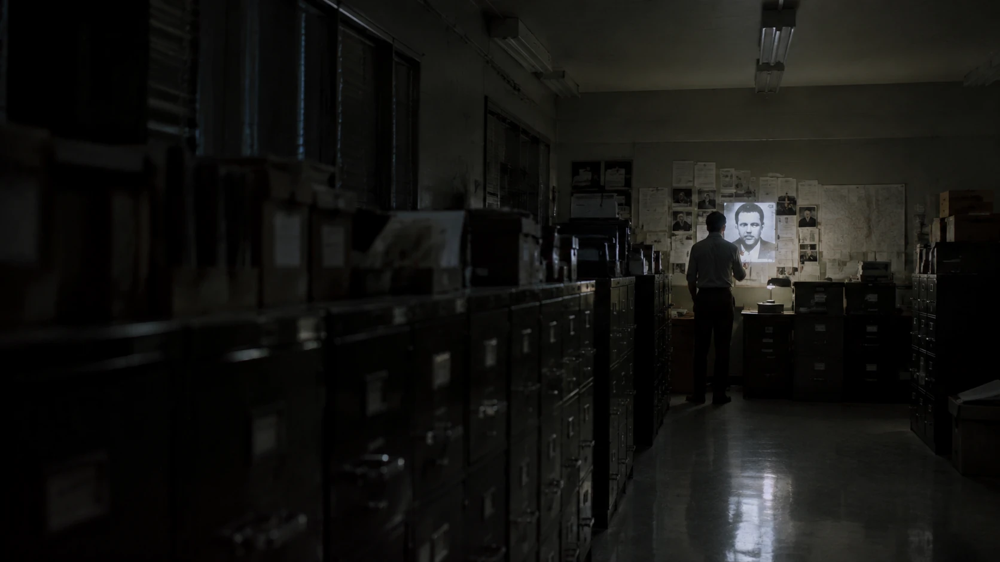
      <br>
      <strong>丹尼斯·维伦纽瓦</strong>
      <br>
      <sub>空间压迫、负空间与环境中的渺小人物</sub>
    </td>
  </tr>
  <tr>
    <td width="50%" align="center">
      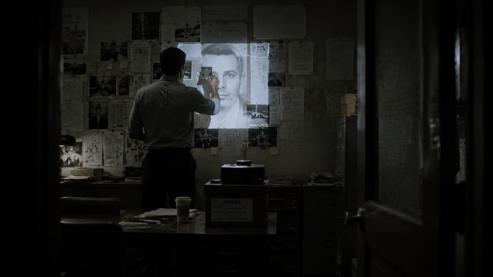
      <br>
      <strong>大卫·芬奇</strong>
      <br>
      <sub>程序信息、精确机位与受控的证据层级</sub>
    </td>
    <td width="50%" align="center">
      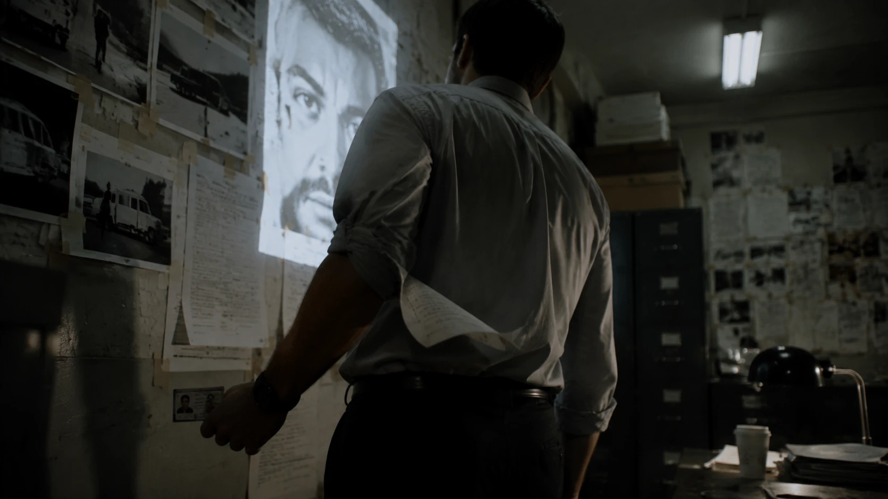
      <br>
      <strong>泰伦斯·马力克</strong>
      <br>
      <sub>身体停顿、触觉干扰与不完整的投影时刻</sub>
    </td>
  </tr>
</table>

| 版本 | 镜头主要在看什么 |
|---|---|
| 无导演基准 | 侦探如何完成员工卡与监控投影的比对 |
| 王家卫 | 深夜孤独、反射、遮挡与不完整的心理关系 |
| 斯坦利·库布里克 | 个人如何被制度空间和几何秩序控制 |
| 丹尼斯·维伦纽瓦 | 渺小侦探如何面对比自己更沉重的证据系统 |
| 大卫·芬奇 | 卡片、投影、照片和文字如何组成严密的信息链 |
| 泰伦斯·马力克 | 疲惫身体、纸边、袖口与投影光如何打断程序动作 |

> 所有版本都保留相同故事事实。差异来自导演对具体时刻、视觉中心、机位、调度、光线、景深和质感的重新选择。

[查看六组完整调用文本、Final Prompt 与 Avoid](docs/director-style-comparison.md)

## 完整输入卡片

第一次使用时，可以直接复制这张卡片。填不完也没关系：

```text
请使用 $zy-cinematic-realism：

故事类型：
时间与地点：
人物：
刚刚发生了什么：
此刻的小动作：
情绪：
希望的观察位置：
最不想出现的效果：

请输出：
1. 画面理解
2. 完整英文 Final Prompt
3. 当前场景专属 Avoid
```

## 安装到 Codex

OpenAI 当前文档说明，Codex 会从用户级 `$HOME/.agents/skills` 与项目级 `.agents/skills` 目录发现 Skill；也可以让内置的 `$skill-installer` 从其他 GitHub 仓库安装。详见 [OpenAI：Build skills](https://learn.chatgpt.com/docs/build-skills)。

### 方法一：让 Codex 从 GitHub 安装

在 Codex 中输入：

```text
请使用 $skill-installer，从下面的 GitHub 仓库安装 zy-cinematic-realism：
https://github.com/popopo-99/zy-cinematic-realism
```

如果当前 Codex 界面提供 Skills 安装或本地导入入口，也可以选择 Release 下载的 ZIP，或解压后的 `zy-cinematic-realism` 文件夹。不同产品界面的入口可能不同。

### 方法二：手动安装

从 [Releases](https://github.com/popopo-99/zy-cinematic-realism/releases/latest) 下载并解压，将完整的 `zy-cinematic-realism` 文件夹复制到用户级 Skills 目录。

**Windows**

```text
%USERPROFILE%\.agents\skills\zy-cinematic-realism
```

**macOS / Linux**

```text
$HOME/.agents/skills/zy-cinematic-realism
```

也可以只在某个项目中安装：

```text
项目目录/.agents/skills/zy-cinematic-realism
```

Codex 通常会自动发现变更；如果没有出现，请重新启动 Codex。安装后输入：

```text
请使用 $zy-cinematic-realism，把“两个侦探在审讯失败后坐夜班公交车回警局”转换成真实电影单帧 Prompt。
```

## 在 ChatGPT 中使用

### 有 Skills 安装入口

根据 OpenAI 当前说明，Personal Skills 通常面向 ChatGPT Business、Enterprise、Healthcare 和 Edu 用户，实际可用性还会受到工作区设置和权限影响。不要假设所有 ChatGPT 账户都已经开放此功能。详见 [OpenAI：Skills in ChatGPT](https://help.openai.com/en/articles/20001066)。

如果你的账户或工作区已经开放 Skills：

1. 在侧边栏打开 **Plugins / 插件**。
2. 在 Plugin Directory 中进入 **Skills**。
3. 选择 **Create**，再选择 **Upload from your computer**。
4. 上传 Release 中的 `zy-cinematic-realism-v1.1.0.zip`。
5. 扫描和安装完成后，输入 `$zy-cinematic-realism`，或直接描述电影感 Prompt 任务。

Personal Skills 需要分别添加到桌面端和 Web / 移动端，目前不会自动跨这些界面同步。

### 没有 Skills 入口

仍然可以直接使用：

1. 打开 [`zy-cinematic-realism/SKILL.md`](zy-cinematic-realism/SKILL.md)。
2. 将文件内容复制到新的 AI 对话。
3. 在后面附上自己的画面想法。
4. 要求 AI 按照该工作流输出 `Final Prompt` 和 `Avoid`。

这种方式不需要 Codex，也不需要安装插件，只是每次可能需要重新提供规则。

## 仓库与安装包结构

仓库根目录是品牌说明、教程、授权与发布记录；`zy-cinematic-realism/` 才是可安装的 Skill 本体。

```text
zy-cinematic-realism/                 # GitHub 仓库根目录
├── README.md                          # 当前教程与展示页
├── CHANGELOG.md                       # 版本记录
├── LICENSE                            # CC BY-NC 4.0
├── RELEASE_NOTES.md                   # v1.0.0 发布说明
├── docs/
│   └── images/                        # 作品示例图
└── zy-cinematic-realism/              # 可安装 Skill 本体
    ├── SKILL.md
    ├── agents/
    │   └── openai.yaml
    ├── assets/
    │   └── basic-prompt-template.md
    └── references/
        ├── camera-and-light.md
        ├── cinematic-principles.md
        ├── examples.md
        ├── negative-prompts.md
        └── quality-checklist.md
```

Release 安装包的正确结构只有一层顶级 Skill 文件夹：

```text
zy-cinematic-realism-v1.1.0.zip
└── zy-cinematic-realism/
    ├── SKILL.md
    ├── agents/
    ├── assets/
    └── references/
```

## 使用与授权

《造梦师：AI时代电影视觉指南 v1.1》采用 [Creative Commons Attribution-NonCommercial 4.0 International](LICENSE)（CC BY-NC 4.0）授权。

你可以：

- 用于个人学习和非商业创作
- 根据自己的项目修改工作流
- 在保留署名、许可证和来源的情况下分享改编版本

你不可以：

- 将本 Skill 或轻微修改版本重新打包售卖
- 删除作者与来源信息后冒充原创发布
- 未经授权放入付费课程、会员资源、提示词合集或商业产品

转载请注明：

```text
作者：ZY / popopo-99
项目：造梦师：AI时代电影视觉指南
仓库：https://github.com/popopo-99/zy-cinematic-realism
许可证：CC BY-NC 4.0
```

商业合作或授权请联系：

- 抖音：2053586074
- 邮箱：zhang.yanpo@foxmail.com

Skill 生成的具体 Prompt 和用户据此创作的作品，不自动归项目作者所有；用户仍需遵守其所使用 AI 平台的规则和适用法律。

## 最后只记住一句话

> **先让画面成为故事中的一个真实瞬间，再考虑它使用什么镜头和胶片。祝你玩得开心。**

示例图由作者使用 AIGC 创作，用于展示这套工作流追求的叙事与摄影方向。
