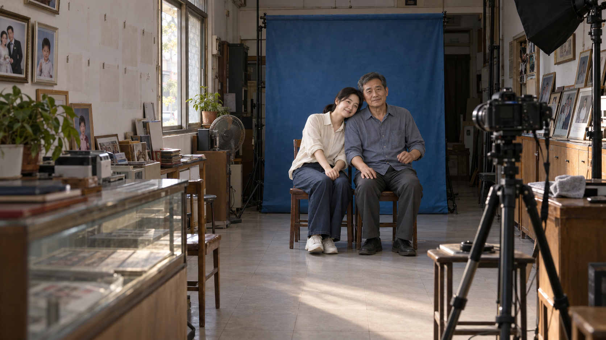

# 《最后一张照片》：从故事到导演美术概念

一个短故事，也可以先开发成给导演讨论的美术画面。本例先理解父女关系，再设计照相馆的空间、材料、造型与光线，最后由用户在外部生成并回传图片。

这是一轮实际定性试用：故事是为本次试用准备的原创短文，以下保留调整用途规则前的真实响应与提示词。它展示一次工作过程，不是旧新版本受控比较，也不是最终拍摄定稿。

## 实际回传的候选图



图片由用户在前序指定的外部 Image2 流程中回传。它用于讨论当前候选方案，具体人物面孔、布景、服装和采光仍可调整。展示副本仅转为无损 WebP，已检查尺寸与逐像素内容相等，没有修饰画面。

## 故事原文

小城一间开了二十多年的照相馆，明天就关门。下午，父亲把墙上的样片一张张取下，女儿回来帮他收拾。她说走之前拍张合照，父亲把两把椅子摆在蓝色背景布前，摆好相机，习惯性退回镜头后面。

女儿坐下却不看镜头，只拍了拍身边的空椅子。父亲说：“你先坐好，我给你拍。”女儿站起来打开倒计时，又坐回去等他。

倒计时响了，父亲放下手里的擦镜布，坐到女儿身边，刚想让她坐直，女儿却靠在他肩上。他停住，笑了一下。快门响了。

## 先找关系变化

原文写父亲一贯回到相机后，女儿用空椅子和倒计时请他进入合照。试用中的解释是：他暂时放下替别人安排姿态的职业习惯，接受女儿靠在自己肩上。这个解释由原文动作支持，不增加家庭前史或新的剧情。

用户反馈这段理解“有帮助”，并希望进一步看到实际画面，尤其是给导演看的美术概念。

<details>
<summary>第一轮实际响应：故事理解、视觉方向与关键画面</summary>

**故事理解：**我理解，这个故事的变化是：父亲习惯了替别人拍照，女儿用空椅子和倒计时，把他请进两人的合照里。最后，他停下纠正她坐姿的念头，接受了这个靠在肩上的女儿。温暖来自这一下很小的变化。

**整体视觉方向：**建议像站在照相馆里，安静看着他们相处。镜头与人平齐，多让父女出现在同一个画面里。用店门玻璃透进来的柔和下午光，蓝色背景布保留普通照相馆的感觉。墙上逐渐空下来的位置交代关店，收拾声、倒计时和快门声带着故事往前走。

**关键画面建议：**

- **照片被取下。**父亲正取下一张样片，女儿在旁边帮着收拾。从店内稍远处看，带上墙上的空位，让观众看见这间店正在收尾。
- **身边的空椅子。**女儿坐着，拍了拍旁边的椅子，父亲仍在相机后面。建议从侧面看，把两人、椅子和相机放在同一画面里。空椅子成为中心，观众一眼就懂她在等谁。
- **快门前的一小下笑。**女儿已经靠在父亲肩上，父亲停住，笑了一下。建议从照相机所在的位置看他们，保留两把椅子和蓝布。最后这张留下的，是他们自然靠在一起的样子。

</details>

## 把情绪落实为美术选择

原文确定的是老照相馆、下午、蓝布、两把椅子、照相机、样片和擦镜布。长方形店面、瓷砖、木柜、侧窗、具体服装及人物面孔都是本轮新增的候选设计。

| 美术选择 | 供导演讨论的作用 |
| --- | --- |
| 蓝布前的椅子与前区照相机 | 能看懂照相馆怎样使用，也为父亲从镜头后走到女儿身边保留通道。 |
| 墙面空位与柜上收下来的样片 | 给收拾状态留下依据；仅凭这些痕迹不能独立确认明天关门。 |
| 乳白墙、灰地砖、普通木柜与朴素衣饰 | 提出日常照相馆的材质关系，避免让装饰压过人物。 |
| 候选侧窗下午光 | 明确可讨论的实际采光方向，让人物、背景和柜台有明暗层次。 |

<details>
<summary>实际美术提案全文</summary>

**美术概念：一间仍然用得好好的照相馆**

以下是一个完整的候选提案。新增的店面、人物面孔、服装、采光与16:9画幅都供导演讨论，尚未确定。保留原文的关店、收拾和合照事件，沿用温暖、克制的方向。

**空间。**建议是一间约四米宽、六米深的长方形店面：玻璃店门在前，蓝色背景布在后墙。两把木椅并排放在蓝布前，照相机架在两米多以外，镜头对着椅子。左墙前半段挂样片，后半段有一扇侧窗；右墙是低木柜，取下的样片靠放在上面。照相机旁有小边桌，方便父亲放擦镜布。柜子和拍摄区之间留出一条通道，他能从镜头后走到女儿身边。

**材料与颜色。**乳白色哑光墙、浅灰瓷砖、普通木柜和木椅，蓝布有自然垂下的褶皱。旧店的年头只落在椅缘的轻微磨亮、样片取下后留下的浅色轮廓上。蓝布是最醒目的颜色，其余物件安静一些，让眼睛最后落到父女身上。

**父女造型。**候选父亲六十岁上下，方脸、短灰发、眼边有细纹，穿灰蓝棉衬衫和深灰长裤，袖口卷到小臂。女儿三十岁左右，略圆的脸、低马尾，穿米白棉衫和深蓝长裤。衣服都是日常穿着，靠近时，肩膀和衣料能自然接触。

**实际光源与主画面。**以拍摄区左侧窗透进来的柔和下午日光照亮两人，玻璃店门的天光给前区一点较弱的光，柜子下方仍有自然暗处。主概念图选快门响前：女儿已经靠在父亲肩上，他停下纠正她坐姿的念头，笑了一下；擦镜布已放在相机旁。观看位置在店内前左侧，与坐着的人大致平齐，斜看拍摄区，让近处的相机、稍远的父女和后面的蓝布同时成立。墙上空位交代收拾，两个人坐到一起交代温情。

</details>

<details>
<summary>实际提交的 Image2 中文提示词</summary>

以下保留当时准备的完整文字。它是一个候选设计，不保证每次生成相同的人物或细节，也没有根据回图悄悄改写。

```text
生成一张16:9横幅的真人电影美术开发画面，用一个完整场景呈现照相馆、父女和照相器材的空间关系，人物面孔与布景采用以下候选设计。小城一间开了二十多年的普通照相馆，明天关门，时间是下午。此刻女儿已经坐在父亲身边，靠在他的肩上；父亲停住了纠正她坐姿的动作，露出一小下笑，合照快门即将响起。父亲坐在画面右边，女儿坐在左边，两人自然靠近。

店面约四米宽、六米深，玻璃入口在前，后墙挂一幅中等深度的蓝色布背景。两把普通木椅并排摆在蓝布前，离布留有距离；一台三脚架上的照相机位于椅子前方两米多处，镜头朝向父女。照相机旁的小边桌上放着父亲刚放下的擦镜布。左墙前半段仍挂着少量肖像样片，旁边可见取下样片后留下的挂钩和浅色轮廓；左墙后半段是一扇侧窗。右墙低木柜上靠放着取下的样片，柜子与拍摄区之间有能让人正常走过的通道。

观看位置在店内前左侧，与坐着的父女大致平齐，斜向后墙。照相机进入画面右侧近处，机身不遮挡父女；父女处于稍远的拍摄区，蓝布在他们身后。人物约占画面高度的一半，能看清肩膀的接触和父亲的小笑，也能看懂房间的使用方式。乳白哑光墙、浅灰瓷砖、普通木柜，木椅边缘只有日常使用形成的轻微磨亮，蓝布自然垂落。父亲六十岁上下，方脸、短灰发、眼边有细纹，灰蓝棉衬衫袖口卷到小臂，深灰长裤；女儿三十岁左右，略圆脸、低马尾、米白棉衫和深蓝长裤。保留自然的皮肤与衣料质感。

柔和的下午日光从拍摄区左侧窗照到父女身上，入口玻璃透进来的较弱天光照到前区，木柜下方和物件背光处自然较暗。蓝色背景布是主要色块，其他颜色朴素，父女的脸和靠在一起的肩膀是视觉中心，次要物件保持正常距离下的清晰程度。温暖来自两人的动作与距离。画面必须是一张完整的场景图，不做三幅拼图、人物海报或纯建筑效果图；不添加广告式精修、刻意破败的装饰或无来源的金色逆光。
```

</details>

## 看成图时，先看它要解决的问题

作为导演前期讨论的空间美术概念，助手观察到：柜台、木柜、样片、蓝布和摄影器材形成可理解的照相馆；墙上空位交代收拾；女儿靠肩、父亲轻笑让亲近关系可读。导演可以据此讨论布局、走位、材料和采光。

如果进一步开发故事关键帧，当前图的关系变化还较弱：人物更像已经坐好的合照，父亲“刚放下纠正女儿的习惯”不够明确。两人似乎朝向观看画面的机位，与右侧场内拍照相机的视线关系也需要理清。原故事本来就在拍合照，坐姿端正本身并非错误；关键是当前瞬间、目光对象和两种机位是否一致。

这些是对本图的观察与判断。用户认可故事理解的帮助并授权继续升级，不等同于对图中全部具体设计完成验收。没有根据这一张宣布普遍电影质感提升，也没有把声音、连续动作或关店时间硬塞进单帧。

## 你可以这样使用

想先让导演讨论美术：

```text
请使用 $zy-cinematic-realism：
根据这段故事，先做一份给导演看的场景美术概念。
说明空间、材料、人物造型、关键道具和实际光源怎样服务故事。
新增设计先作为提案；不用生图，也先不要 Prompt。
```

想开发承载关系变化的镜头：

```text
请使用 $zy-cinematic-realism：
从这段故事里挑一个关系发生变化的瞬间，设计一张叙事关键帧。
说明人物此刻的动作、看向谁，以及我们从哪里看。
不用把完整房间和所有剧情都塞进画面；先不要 Prompt。
```

按你当前要讨论的问题提出请求即可。两种用途可以分开开发，也可以在一张画面中兼顾；不需要记住模式名或每次生成两套图。只要关系分析时，造梦师仍只做分析。需要生成时，再沿用已确定的模型编译提示词。

[《泰坦尼克号》剧本实战](titanic-story-to-frame.md) · [本轮行为检查](behavior-check-art-development-v2.5.md) · [返回首页](../README.md)
