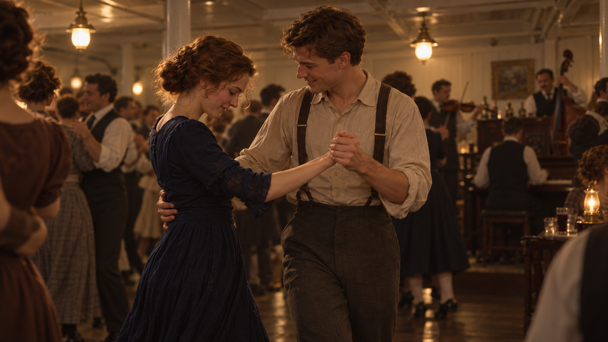

# 从《泰坦尼克号》剧本到视觉开发

这次用三等舱舞会的一段剧本，练习把人物变化转成视觉世界与关键画面。造梦师负责分析、设计与编译提示词，实际图像通过用户外部使用的 Image2 生成，再依据回传结果检查。

新用户可以这样开始：

> 请使用 $zy-cinematic-realism：<br>
> 我有一段剧本，先帮我找人物变化，再开发视觉世界和关键画面。<br>
> 区分原文事实、剧情解读和新导演建议。

## 参考修订后的视觉基准（用户认可方向）



用户评价 P01“效果还不错”，认可它作为后续视觉方向。这是原创视觉开发图，非官方电影剧照；这份认可不代表三张画面或整套连续性设定已经验收。

## 先读出变化，再开发世界

本例使用 James Cameron 署名剧本的第 85、87 场，公开文本可在 [IMSDb](https://imsdb.com/scripts/Titanic.html)读取。网页是第三方呈现，第 86 场标为 omitted；这份网页文本的草稿日期未核实，访问日期为 **2026-10-03**。阅读范围不包含第 88 场或全片；这里用中文简述，不复制整段原文。

第 85 场里，她刚开始不熟悉舞步，跟随男主逐渐找到节奏，随后脱鞋，主动重新投入舞蹈。第 87 场里，她穿着长袜在人群中跳舞；舞曲结束后到了桌边，展示足尖动作，落下后脚痛、抱脚失衡，被男主接住，两人与周围的人笑起来。

| 层次 | 本例怎样使用 |
| --- | --- |
| **原文事实** | 三等舱公共活动室、钢琴旁的临时乐队、最初的生涩、脱鞋后穿长袜、桌边失衡与被接住。动作顺序和鞋袜状态进入关键帧。 |
| **剧情解读** | 她从小心跟随转为主动参与，后来能够把出糗变成共同的笑。这个理解由动作支撑，不能作为新剧情事实。 |
| **视觉提案** | 用握手、身体距离、脚步与人群位置表现变化；决定取景距离、灯光层次和材料关系。具体机位、左右脚分配等是开发选择。 |

### 本次共同设计

初始实验为两版预先固定了原创造型：成年女主的棕色卷发低髻、深蓝晚礼长裙和象牙长袜；男主的栗色短发、米色卷袖棉衬衫与深灰背带长裤。房间采用浅色舱壁、深木地板、结构柱、实际暖吊灯，钢琴与临时乐队在一端，桌子在边缘。

这些是案例设计条件。**原稿写高跟鞋，本例共同采用黑色低跟鞋，是主动改编。** 不将颜色、材料或这次原创人物外观说成原稿自带信息。

视觉世界围绕“欢乐中的亲近”组织：人物处在真实舞会的人群里，脸、手与身体关系成为观看重点；背景亮度和清晰度退后，暖光有层次。共同设定进入现有 Scene Master 与连续性规则，具体画面的姿态和景别仍按动作调整。

## 从提案到图像的实际工作方式

1. **剧情分析**：确认可读范围，保留原文事件、地点、鞋袜和道具状态，解释人物变化。
2. **视觉提案**：给动作选择一个可见瞬间，说明人物关系怎样通过空间、目光与身体表现。
3. **造梦师解梦参考**：读取实际提供的参考，分别确认身份、服装、空间和光影职责；从真实图像提取可迁移关系，参考的姿势与裁切按新动作调整。
4. **编译并外部生成**：接入现有模型编译器，为用户使用的 Image2 整理提示词，由用户在外部生成并回传。
5. **检查与继续**：检查动作接触、支撑脚、手的占用、衣饰状态和视觉重心；把用户实际接受的变化用于后续。

P01 后来作为后两帧的身份、服装、场景与光影参考。它不锁定后两帧的姿势、表情或裁切，也不保证连续性已经通过。

<details>
<summary>P01 实际使用的参考修订提示词（Image2）</summary>

这条提示词保留当时提交的文字，使用时须同时提供三份参考：图一是修订前的人物与舱室图，图二提供暖色室内双人的明暗关系，图三提供人物与人群的空间关系。原任务的参考拼图不在此公开转载；替换参考后，需要先重新解梦，不能把下列图号直接当作当前参考。

```text
以图一作为人物身份、服装和1912年客轮三等舱活动室的参考。以图二中暖色室内双人画面的明暗层次为主要视觉参考，以图三的人物与人群关系辅助构图。生成一张16:9真人电影单帧，不要拼图，不引入图二、图三的人物、军装、海岸、废墟或战争情节。

表现两人刚开始跟舞的一个瞬间。男主左手握住女主右手，右手扶她腰背，正退半步带动她；她跟出一步，上身尚未完全跟上，肩膀微紧，先垂眼确认步伐。男主看她的反应，握住的手留在两人之间，不向镜头展示舞姿。保留她谨慎尝试、他耐心带动的亲近与欢乐。

镜头站在舞池边缘，走近两人，取膝以上的双人中景，重点是面孔、相握的手和身体重心变化。附近一位舞者的肩膀自然切入画面边缘，后方人群继续跳舞，让两人置身于正在发生的舞会。钢琴与乐队只需作为可辨认的背景，不再突出白柱和大片空地。

左上方的一盏既有暖吊灯照到两人的部分脸颊、肩膀和手，面孔另一侧保留自然阴影。后排舞者与浅色舱壁的亮度低于主要人物；暖色集中在受光处，暗部保持低饱和灰褐，不让整张图覆盖同一层金黄。皮肤有自然明暗起伏，深蓝裙料与棉衬衫呈现柔软哑光，背景细节自然退后。避免均匀补光、磨皮、全幅硬锐化和油亮地板。
```

原稿事件与鞋袜时间顺序继续保留，P01 仍穿鞋。这条文字连同实际参考和用户回图，记录了一次用户认可方向的修订；单独提示词不保证重现相同视觉效果。

</details>

## 三个节点与真实状态

| 节点 | 画面任务 | 当前状态 |
| --- | --- | --- |
| **P01 · 初次跟随** | 以握手、相互观看和略显拘谨的身体关系表现尝试。 | 外部修订图已回传，用户认可作为后续视觉方向；展示在上方。 |
| **P02 · 主动入场** | 已脱鞋、穿长袜，主动牵引男主；为脸、手与袜脚调整景别。 | 用户认为 AI 感仍重、观感不满意；视觉未通过，待改进。 |
| **P03 · 桌边相笑** | 足尖展示结束后抱脚失衡，被扶稳再一起笑；保留桌边、无鞋与少量啤酒湿痕。 | 用户未接受外部结果；视觉未通过，待改进。 |

用户明确要求停止图片迭代，继续推进仓库升级，P02/P03 因而不作为成功效果展示。本例不宣称整体电影画质提升，也不把单张接受升级为全案例通过。

初始实验的关键帧和造型由共同任务预先固定。这是受约束的剧本到视觉转化实例，不是自主选帧或全文理解测试；两版真实文字输出与比较边界见[文字比较记录](titanic-comparison-v2.5.md)。

[返回首页](../README.md) · [剧本到画面工作流](../zy-cinematic-realism/references/story-visual-development.md) · [本次验证](validation-v2.5.md)
